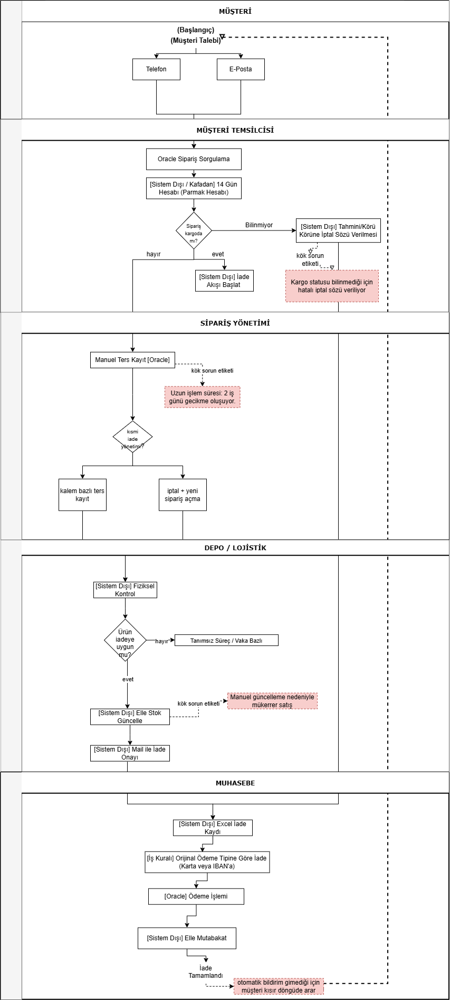
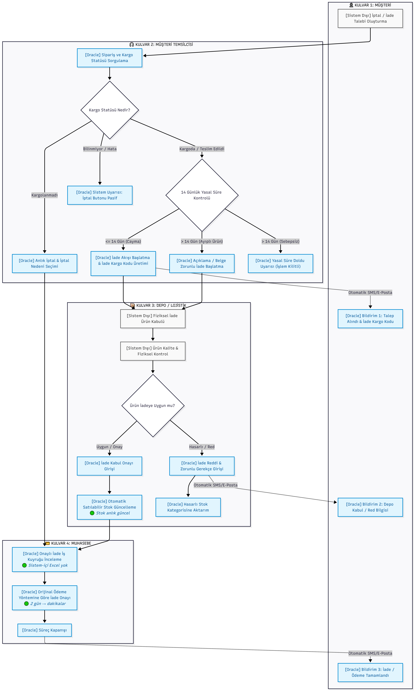

# Oracle ERP — Order Cancellation & Return Process Automation

**Business analysis case study** · An end-to-end requirements package, from stakeholder interview to UAT

[`Türkçe`](README.md) · `English`

---

At a technology retailer selling online, orders are managed in Oracle ERP — but **cancellation and
return requests arrive by email and phone and are handled entirely by hand.** This package is the
complete requirements analysis for moving that process end to end into the ERP.

The original request was a single sentence: *"Let cancellations and returns run through the system
from now on, no more manual work."* This package shows how that vague sentence became measurable
requirements, business rules and testable acceptance criteria.

## At a glance

| | |
|---|---|
| **Role** | Business Analyst (sole ownership of the analysis) |
| **Scope** | Turkey B2C cancellation and return process, Oracle ERP |
| **Stakeholders** | 7 stakeholders across 5 departments |
| **Method** | Stakeholder analysis → requirements interview → as-is/to-be modelling → BRD → user stories → UAT |
| **Tools** | draw.io, Word, Excel, Git/GitHub |
| **Artefacts produced** | Stakeholder matrix · 15-question interview design · 2 swimlane diagrams · BRD-lite · 11 user stories (Given/When/Then) · 12 UAT scenarios · traceability matrix |

## The problem

Because the process runs outside Oracle ERP, it cannot be measured, audited, or kept from
repeating itself. The analysis surfaced **five root causes**:

| # | Root cause | Operational impact |
|---|---|---|
| 1 | **Lack of visibility** — the agent cannot see shipping status in the system | Cancellations get promised on already-shipped orders; ~2 incidents a month at risk |
| 2 | **Long cycle time** — cancellations are processed via manual reversal entries | A single cancellation takes **2 business days** on average |
| 3 | **Non-standard decisions and stock errors** — partial returns handled differently per person, stock updated by hand | Sellable stock reads incorrectly; risk of selling the same unit twice |
| 4 | **Off-system Excel tracking** — accounting tracks returns in a separate file outside the ERP | Month-end ERP reconciliation is done manually |
| 5 | **No notifications** — the customer is never told automatically | "Where is my money?" calls create a loop that resets the process |

**Volume:** roughly **120 cancellation/return requests per month**, directly affecting
**3 departments**.

## Goals and success measures

| Goal | Target | Measurement |
|---|---|---|
| Cycle time (SLA) | From days down to minutes *(exact figure awaiting sponsor sign-off — Q-03)* | ERP transaction timestamps |
| Off-system tracking | 0% (Excel tracking fully retired) | Warehouse and accounting audit reports |
| Duplicate sales / stock errors | 0% | Incorrect-stock and negative-stock incident reports |
| Customer contact loop | **80% reduction** in "where is my money" calls | Customer service call categorisation |
| Shipping visibility accuracy | 100% live API accuracy | Shipping integration logs |

## Scope

<table>
<tr><th width="50%">✅ In scope</th><th width="50%">⛔ Out of scope</th></tr>
<tr valign="top">
<td>

- Turkey B2C operation and B2C e-commerce/sales channels
- Receiving the customer request
- 14-day statutory withdrawal period check
- Live shipping status lookup
- Cancellation of unshipped orders
- Return of shipped / delivered goods
- Warehouse physical receipt and quality control
- Automatic stock updates
- Refunds (card / bank transfer)
- Automatic customer notifications

</td>
<td>

- Corporate / B2B (wholesale) cancellation and return processes
- Customer self-service return requests via the website *(under consideration for phase 2)*
- Any new payment infrastructure or POS provider integration outside the ERP
- Audit log technical testing *(to be run by the IT team)*

</td>
</tr>
</table>

**Systems affected:** Oracle ERP (primary), courier API (integration), accounting Excel files (to
be fully retired at go-live).

## Process modelling — as-is and to-be

<table>
<tr>
<th width="50%">As-Is — current state</th>
<th width="50%">To-Be — target state</th>
</tr>
<tr valign="top">
<td></td>
<td></td>
</tr>
<tr valign="top">
<td>

**Five lanes.** Most steps are tagged `[Off-system]`: mental arithmetic for the 14-day window,
blind cancellation promises, manual stock updates, return approval by email, Excel return
records, manual reconciliation. Red annotations mark exactly where each root cause sits in the flow.

</td>
<td>

**Four lanes.** The "Order Management" lane that performed manual reversal entries
**disappears entirely** — once the work moves into the ERP, that lane loses its reason to exist.
Shipping status splits the flow three ways up front, the statutory check runs in the system, and
notifications fire automatically.

</td>
</tr>
</table>

> Diagrams are clickable for full resolution. Source files live in [`diagrams/`](diagrams/).

## Business rules

| ID | Rule |
|---|---|
| **BR-01** | If shipping status is "Not shipped" the **cancellation** flow fires; if "In transit"/"Delivered" the **return** flow fires. If the status cannot be read, the system warns the agent and blocks blind cancellation. |
| **BR-02** | Accounting refund approval only unlocks once the Warehouse/Logistics role has given an "Eligible for return" approval. This is **mandatory**. |
| **BR-03** | Refunds follow the customer's original payment method automatically: card payment → refund to card, bank transfer → transfer to IBAN. |
| **BR-04** | Withdrawal-right returns must be initiated within **14 calendar days** of delivery. Defective/damaged goods are exempt from this limit. |
| **BR-05** | Multi-item orders support line-level partial returns; the returned line's amount is deducted from the order. |

## Requirements

**15 functional requirements (FR)** and **5 non-functional requirements (NFR)** were defined, each
FR traced to its governing business rule.

<b>Functional requirements (15) — click to expand</b>

| ID | Requirement | Related BR |
|---|---|---|
| FR-01 | The order lookup screen must display the courier and live shipping/delivery status. | BR-01 |
| FR-02 | Unshipped orders must support single-step, immediate cancellation. | BR-01 |
| FR-03 | Shipped or delivered orders must be routed automatically into the return flow. | BR-01 |
| FR-04 | The refund amount and payment step must derive the original payment type automatically from order data. | BR-03 |
| FR-05 | The 14-day withdrawal period must be checked; the agent must be warned when it has lapsed, and the check must be disabled for defective goods. | BR-04 |
| FR-06 | Partial returns must be processable at line level without breaking the parent order. | BR-05 |
| FR-07 | Refund approval must not be available in accounting screens for returns lacking warehouse approval. | BR-02 |
| FR-08 | Financial tracking of the return must run end to end in Oracle; no off-ERP tracking should remain necessary. | General |
| FR-09 | An automatic SMS and email must be sent to the customer the moment accounting approves the refund. | General |
| FR-10 | Sellable stock must update automatically, in sync with the warehouse return acceptance. | BR-02 |
| FR-11 | When shipping status cannot be read, the agent must be warned and cancellation blocked until the status is confirmed. | BR-01 |
| FR-12 | On creating a return request, a unique "return shipping code / reference number" must be generated and shown on the agent's screen. | BR-01 |
| FR-13 | Cancellation must offer a predefined reason list, and the selected reason must be written to the order detail record. | BR-01 |
| FR-14 | Returns assessed as "damaged / not fit for resale" must not be added to sellable stock; they must move automatically to an "inspection / damaged stock" category. | BR-02 |
| FR-15 | Returns raised under "defective / faulty product" must require a description and a supporting document or image. | BR-04 |

<b>Non-functional requirements (5) — click to expand</b>

| ID | Category | Requirement |
|---|---|---|
| NFR-01 | Performance | Cancellation/return lookup and trigger operations must complete within **5 seconds** under load. |
| NFR-02 | Usability | Initiating a cancellation or return must be achievable in at most **3 clicks**. |
| NFR-03 | Traceability | An audit log holding user ID, timestamp and stage must be kept for every step. |
| NFR-04 | Security / authorisation | Warehouse approval must be restricted to the "Warehouse/Logistics" role and refund approval to the "Accounting/Finance" role. |
| NFR-05 | Compliance | Data retention must comply with Turkish distance-selling regulations and KVKK (the Turkish GDPR equivalent). |

## User stories

**11 user stories across 9 epics**, each written with Given/When/Then acceptance criteria in three
layers: **happy path**, **alternative path** and **error case**. Dependencies and priorities (Must
Have / High) are stated on every story.

| Epic | User story |
|---|---|
| E1 · Shipping & status visibility | US-01 View current shipping status |
| E2 · Order cancellation | US-02 Immediate cancellation of unshipped orders, with reason capture |
| E3 · Return routing & statutory period | US-03 Return flow routing + return shipping code · US-04 14-day statutory period check and exemptions |
| E4 · Partial transactions | US-05 Line-level partial cancellation and return |
| E5 · Warehouse control and approval | US-06 Warehouse physical receipt and quality assessment |
| E6 · Refunds & accounting | US-07 Refund by original payment method · US-08 Payment lock where warehouse approval is missing |
| E7 · Customer communication | US-09 Automatic customer notifications at process milestones |
| E8 · Stock management | US-10 Category-based automatic stock update on accepted returns |
| E9 · Traceability and audit | US-11 Audit log tracking |

<b>Example: US-04 — 14-day statutory period check</b>

> **As a** customer service agent, **I want** the system to check the 14-day statutory withdrawal
> period from the delivery date on return requests, **so that** I no longer calculate dates by
> hand and can filter out unjustified late returns in line with the rules.

**Scenario 2 — Alternative path (defective goods exemption with mandatory evidence)**

- **Given** an order where more than 14 days have passed since delivery,
- **When** the agent selects "Defective / faulty product" as the return reason,
- **Then** the system must lift the 14-day block, but require a description or supporting
  document/image before accepting the return request.

*Related FR: FR-05 · Related BR: BR-04 · Priority: Must Have · Depends on: US-03*

## UAT and traceability

**12 UAT scenarios** and a **9-record test data set** (TEST-1001…TEST-1009) were prepared.
Scenarios are classified as happy path, alternative path and negative test; UAT-06 is complex
enough that it is additionally documented step by step in a "showcase" format.

The traceability matrix showing which UAT scenario validates each user story:

| User story | Coverage | Related UAT | Priority |
|---|---|---|---|
| US-01 | View current shipping status | UAT-01, UAT-02 | High |
| US-02 | Immediate cancellation of unshipped orders + reason capture | UAT-03 | High |
| US-03 | Return flow routing + return shipping code | UAT-04 | High |
| US-04 | 14-day statutory period check + exemptions | UAT-05, UAT-06, UAT-07 | High |
| US-05 | Line-level partial cancellation and return | UAT-08 | Medium |
| US-06 | Warehouse physical acceptance / rejection | UAT-09, UAT-10 | High |
| US-07 | Refund by payment method | UAT-12 | High |
| US-08 | Payment lock without warehouse approval | UAT-11 | High |
| US-09 | Automatic customer notifications | UAT-12 *(combined test)* | High |
| US-10 | Automatic stock update (category-based) | UAT-09, UAT-10 *(combined test)* | High |
| US-11 | Audit log | Out of scope — IT technical test | Low |

**Result:** 12 UAT scenarios cover 10 user stories. US-11 (audit log) was deliberately left out of
UAT scope — it is a technical validation and will be tested by the IT team.

## Risks and open questions

Rather than closing the analysis as if everything were settled, uncertainties were recorded
explicitly.

<b>Risks and mitigations (4)</b>

| ID | Risk | Likelihood / Impact | Mitigation |
|---|---|---|---|
| R-01 | Shipping status unreadable due to courier API latency or outage | High / High | A "fallback" button for phase 1 that queries by manual tracking number |
| R-02 | Accounting resisting the move away from Excel tracking | Medium / High | Bring accounting into UAT early, plus a 2-week parallel-run period |
| R-03 | Discount allocation rule for partial returns left unresolved | Medium / Medium | Hold a priority decision meeting before analysis closes (tracking Q-04) |
| R-04 | Defective-goods return flow introducing design ambiguity | Medium / Medium | Keep phase 1 to the basic logic and split complex cases into phase 1.5 |

<b>Open questions and pending decisions (5)</b>

| ID | Open question | Owner |
|---|---|---|
| Q-01 | What is the refund rule for coupons and gift vouchers used on cancelled/returned orders? | Finance / Accounting |
| Q-02 | What is the procedure and customer-communication rule for items found damaged/used at the warehouse? | Finance + Warehouse |
| Q-03 | What is the target cycle time (SLA) KPI? | Business sponsor |
| Q-04 | How should basket-level discounts be allocated across items on partial returns? | Finance / Accounting |
| Q-05 | Who owns collecting the IBAN on bank-transfer refunds — the agent or accounting? | Business sponsor |

## Artefacts

Every document is available both as **browser-readable Markdown** and in its **original Office**
format:

| # | Artefact | Read in browser | Download |
|---|---|---|---|
| 01 | Stakeholder list and requirement questions (15 questions) | [`01_paydas_ve_sorular.md`](docs/01_paydas_ve_sorular.md) | — |
| 02 | Requirements interview summary | [`02_gorusme_ozeti.md`](docs/02_gorusme_ozeti.md) | — |
| 03 | BRD-lite (business requirements document) | [`03_brd-lite.md`](docs/03_brd-lite.md) | [`.docx`](docs/03_brd-lite.docx) |
| 04 | User stories (11 stories, 9 epics) | [`04_user_stories.md`](docs/04_user_stories.md) | [`.docx`](docs/04_user_stories.docx) |
| 05 | UAT document (12 scenarios + traceability) | [`05_uat_dokumani.md`](docs/05_uat_dokumani.md) | [`.xlsx`](docs/05_uat_dokumani.xlsx) |
| — | As-is / to-be swimlane diagrams | [`diagrams/`](diagrams/) | — |

> Source documents are written in Turkish. This page summarises their full content in English.

## Method and tools

- **Stakeholder analysis:** influence/interest matrix and a RACI split across 7 stakeholders
- **Requirements elicitation:** a 15-question interview design across 6 categories (as-is,
  business rules, volume and impact, exceptions, goals and success measures, scope and
  constraints) — the interview itself was run as a simulation
- **Process modelling:** as-is / to-be swimlane flows in draw.io with root-cause annotation
- **Documentation:** BRD-lite, Given/When/Then user stories, UAT scenarios
- **Version control:** Git / GitHub

## What I learned

**What a stakeholder says and what they need are not the same thing.** I went into the interview
with a one-sentence request — "no more manual work" — and my questions surfaced **six hidden
business rules**. None of them were in the original request. The 14-day statutory window, the rule
that no refund can be paid without warehouse approval, refund method following the original payment
type: these only emerged once the right question was asked.

**The hardest part of documentation is fidelity.** I took the requirements summary through
**three iterations** of stakeholder sign-off. My mistake in the first version was a loss of
fidelity in writing down what I had heard: I was compressing the stakeholder's words into my own
interpretation and shifting the meaning. I solved it with a **feedback checklist** method — reading
each item back in the stakeholder's own words and confirming it.

**Recording uncertainty instead of hiding it.** Rather than inventing decisions like the SLA target
or the discount allocation logic, I listed them as open questions (Q-01…Q-05) with an owner and an
impact. The maturity of a requirements document is measured less by what it knows than by **how
clearly it states what it does not**.

## Note on fiction

This is a fictional case study created for educational and portfolio purposes. The company, people
and processes within it are invented; it contains no real company name, real customer data or real
corporate screenshots. Its purpose is to demonstrate BRD authoring, requirements analysis and
process modelling capability through concrete artefacts.

---

**Senanur Yıldırım** · Business Analyst
[LinkedIn](https://www.linkedin.com/in/senanur-yildirim) · [senanur.yildirim.ba@gmail.com](mailto:senanur.yildirim.ba@gmail.com)

